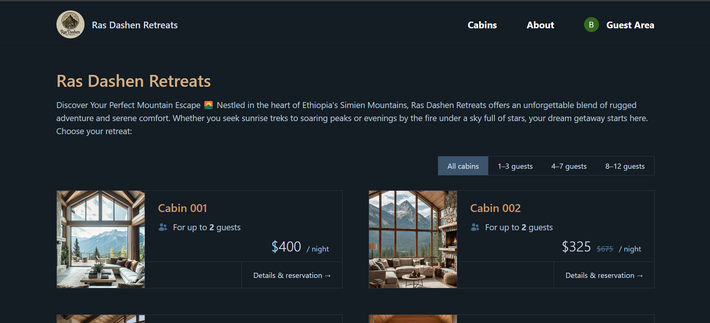

# 🏔️ Ras Dashen Retreats

Ras Dashen Retreats is a full-stack web application that allows users to explore, view, and book scenic cabin retreats. Built with **Next.js 15**, **Supabase**, **NextAuth v5**, and **Tailwind CSS**, this modern platform supports Google OAuth authentication, dynamic cabin listing, and a personalized user dashboard.

## 📸 Screenshots

### 🏠 Homepage – Featured Retreats and Navigation


---

### 🛏️ Cabins List – Explore Available Cabins



---

### 🏕️ Cabin Details – View Amenities and Booking Info


---

### 👤 User Dashboard – Manage Profile and Bookings


---

## 🛠️ Tech Stack

| Tech             | Description                        |
| ---------------- | ---------------------------------- |
| **Next.js 15**   | App router, server actions, SEO    |
| **React 19**     | Modern UI with concurrent features |
| **Tailwind CSS** | Utility-first styling              |
| **Supabase**     | Backend as a Service (auth & DB)   |
| **NextAuth v5**  | Google OAuth for secure auth       |
| **TypeScript**   | Type-safe development              |
| **Vitest**       | Unit testing framework             |

---

---

## ⚙️ Environment Variables

Create a `.env.local` file and include:

```env
SUPABASE_URL=your_supabase_url
SUPABASE_KEY=your_supabase_anon_key
NEXTAUTH_URL=http://localhost:3000
NEXTAUTH_SECRET=your_random_secret
AUTH_GOOGLE_ID=your_google_client_id
AUTH_GOOGLE_SECRET=your_google_client_secret

```
